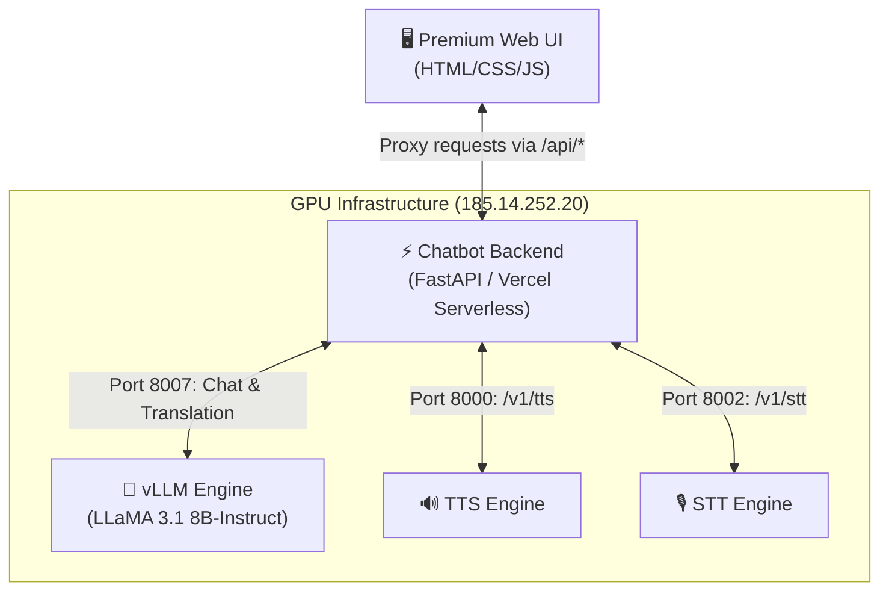

# ConversaAI Chatbot with Voice Gateway Integration

A professional, high-performance web interface and FastAPI backend proxy for **LLaMA 3.1 8B-Instruct** (hosted via **vLLM** on your GPU server). It seamlessly integrates with your existing **Voice Gateway** endpoints (`185.14.252.20`) to handle Speech-to-Text (STT) and Text-to-Speech (TTS).

---

## 🏗️ Architecture & Port Mappings



| Service | Host | Port | Endpoint / Path | Purpose |
| :--- | :--- | :--- | :--- | :--- |
| **vLLM Engine** | `185.14.252.20` | **8007** | `/v1/chat/completions` | Large Language Model (Inference) |
| **TTS Engine** | `185.14.252.20` | **8000** | `/v1/tts` | Text-to-Speech (Audio output) |
| **STT Engine** | `185.14.252.20` | **8002** | `/v1/stt` | Speech-to-Text (Voice input) |
| **Local Proxy Backend** | `localhost` | **8008** | `/api/*` | Local development API gateway |

---

## 🚀 Getting Started

### 1. Local Development (Backend & Frontend)

#### Prerequisites
* Python 3.10+
* Local dependencies: `pip install -r server/requirements.txt`

#### Steps
1. Navigate to the `server` directory and copy `.env.example` to `.env`:
   ```bash
   cp server/.env.example server/.env
   ```
2. Open `server/.env` and verify the settings:
   ```env
   PORT=8008
   VLLM_BASE_URL=http://185.14.252.20:8007/v1
   VLLM_API_KEY=EMPTY   # Change this to your API Key if secured
   VLLM_MODEL=meta-llama/Llama-3.1-8B-Instruct
   
   TTS_ENGINE_URL=http://185.14.252.20:8000
   STT_ENGINE_URL=http://185.14.252.20:8002
   ```
3. Run the local backend:
   ```bash
   python server/main.py
   ```
4. Access the web interface at **`http://localhost:8008`**.
5. Check health check stats directly at **`http://localhost:8008/api/engine-health`**.

---

### 2. GPU Server Setup (vLLM Engine)

If you need to install or start the vLLM engine on the GPU server at `185.14.252.20`:

1. Copy [gpu_setup.sh](file:///Users/taqaddusshafi/Desktop/chatbot/server/gpu_setup.sh) to your GPU host.
2. Initialize the environment:
   ```bash
   export HF_TOKEN=your_hugging_face_token_here
   chmod +x gpu_setup.sh
   ./gpu_setup.sh
   ```
3. Start the service (runs on port **`8007`**):
   ```bash
   ./start_server.sh
   ```

> [!TIP]
> **Securing the vLLM Server:**
> Since your GPU is exposed on a public IP, secure it by adding `--api-key your_secret_key` when launching `vllm serve`. Then update `VLLM_API_KEY` to match it in your chatbot `.env`.

---

### 3. Deploying to Vercel (Production)

This repository is pre-configured for instant deployment on Vercel:

1. Deploy the directory using the Vercel CLI or connect it to GitHub:
   ```bash
   vercel
   ```
2. Configure these Environment Variables on your Vercel Project Dashboard:
   - `VLLM_BASE_URL` = `http://185.14.252.20:8007/v1`
   - `VLLM_API_KEY` = `EMPTY` (or your custom API key)
   - `VLLM_MODEL` = `meta-llama/Llama-3.1-8B-Instruct`
   - `TTS_ENGINE_URL` = `http://185.14.252.20:8000`
   - `STT_ENGINE_URL` = `http://185.14.252.20:8002`

---

## 🧪 Verification & Testing Commands

Verify connection health using these simple curl requests:

```bash
# 1. Test local proxy health
curl http://localhost:8008/api/health

# 2. Check engine connectivity (vLLM, TTS, STT)
curl http://localhost:8008/api/engine-health

# 3. Test LLM Chat streaming
curl -X POST http://localhost:8008/api/chat \
  -H "Content-Type: application/json" \
  -d '{"messages":[{"role":"user","content":"Hello"}], "stream": false}'

# 4. Test Translation (Auto-detects language and translates)
curl -X POST http://localhost:8008/api/translate \
  -H "Content-Type: application/json" \
  -d '{"text":"Good morning, how are you?"}'
```

---

## 🔌 AI Gateway Integration (OpenAI-compatible)

This service is a **stateless microservice** and exposes a standard **OpenAI-compatible** surface, so any AI gateway (Kong AI Gateway, Portkey, LiteLLM, Cloudflare AI Gateway, OpenRouter, LangChain, …) can register it as an OpenAI-style provider.

| Endpoint | Method | Contract |
| :--- | :--- | :--- |
| `/v1/chat/completions` | `POST` | OpenAI chat completions — streaming **and** non-streaming. Transparent proxy to vLLM, so `usage`, `id`, and `finish_reason` are preserved. |
| `/v1/models` | `GET` | OpenAI model list (proxied from vLLM). |

The default chat system prompt is injected **only when the caller does not provide a `system` message**, so gateways retain full control of behavior.

Point your gateway's provider **base URL** at this service and use the OpenAI SDK directly:

```bash
# Non-streaming
curl -X POST https://<your-app>.vercel.app/v1/chat/completions \
  -H "Content-Type: application/json" \
  -H "Authorization: Bearer ANY" \
  -d '{"model":"meta-llama/Llama-3.1-8B-Instruct","messages":[{"role":"user","content":"Hello"}]}'

# Streaming
curl -N -X POST https://<your-app>.vercel.app/v1/chat/completions \
  -H "Content-Type: application/json" \
  -d '{"messages":[{"role":"user","content":"Hello"}],"stream":true}'
```

```python
# OpenAI SDK — just change base_url to this microservice
from openai import OpenAI
client = OpenAI(base_url="https://<your-app>.vercel.app/v1", api_key="ANY")
resp = client.chat.completions.create(
    model="meta-llama/Llama-3.1-8B-Instruct",
    messages=[{"role": "user", "content": "Hello"}],
)
```

> The `/api/*` endpoints (`/api/chat`, `/api/translate`, `/api/voice/stt`) remain available for the bundled web UI; `/v1/*` is the gateway-facing contract.

---

## ✨ Key Features Included

* **Streaming SSE Chat:** True word-by-word real-time generation.
* **Premium Glassmorphic UI:** Smooth dark mode layouts, typography (Inter & Noto Sans Arabic), micro-animations, and dynamic status dots.
* **RTL Language Detection:** Automatic right-to-left layout formatting for Arabic messages.
* **Integrated translation mode:** Simple toggle to swap between conversational chatbot and high-fidelity translator.
* **Voice input (STT):** Record from the mic and auto-transcribe to text via the STT engine.
