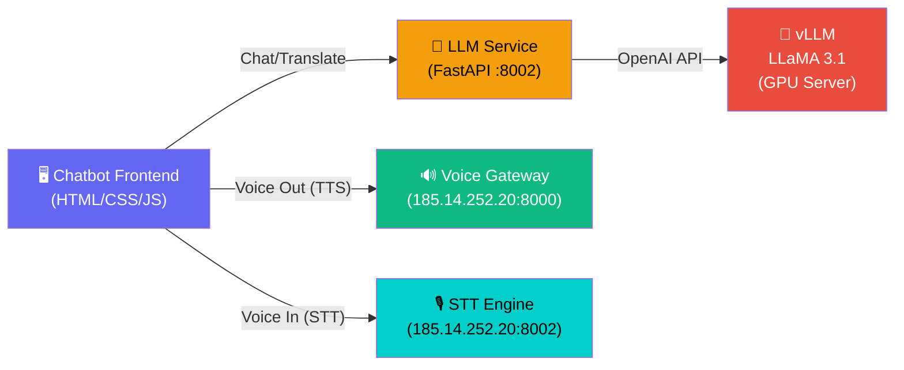
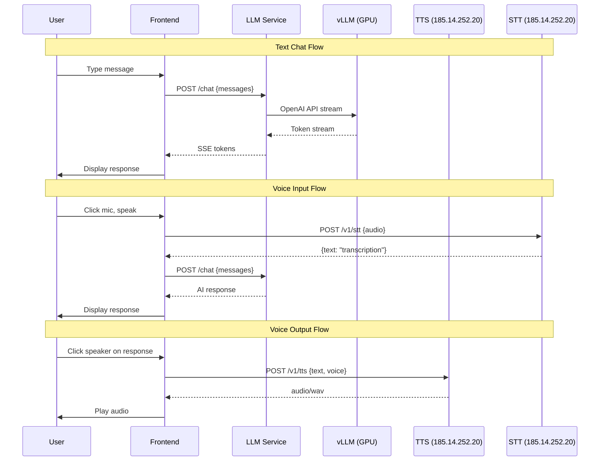

# AI Chatbot with Voice Gateway Integration

Build a professional chatbot powered by **LLaMA 3.1 8B-Instruct** that integrates with your existing **Voice Gateway** system for voice I/O (TTS/STT).

## Architecture Overview



### How It Works
1. User types or speaks → STT converts speech to text
2. Text goes to LLM Service → forwards to vLLM on GPU → returns AI response
3. AI response shown in chat → optionally spoken aloud via TTS
4. Translation mode uses specialized system prompts for Arabic ↔ English

---

## User Review Required

> [!IMPORTANT]
> **Your existing Voice Gateway** at `http://185.14.252.20` already handles TTS (port 8000) and STT (port 8002). The chatbot will reuse these endpoints directly — no need to duplicate voice infrastructure.

> [!WARNING]
> **GPU Server for LLM**: Where will vLLM run? Options:
> 1. **Same server** as your TTS/STT (`185.14.252.20`) — simplest, if GPU has spare capacity
> 2. **Separate GPU server** — if the L40 is a different machine
>
> I'll set it up so the LLM endpoint URL is configurable in `.env`.

## Open Questions

> [!IMPORTANT]
> 1. **Where does vLLM run?** Same machine as TTS/STT (`185.14.252.20`) or a different GPU server?
> 2. **What port for vLLM?** I'll default to `8003` to avoid conflicts with TTS (8000) and STT (8002).
> 3. **Do you want the chatbot to auto-speak responses** via TTS, or only on-demand (click a speaker icon)?

---

## Proposed Changes

### Component 1: LLM Chat Service (FastAPI Backend)

A lightweight FastAPI service that acts as a bridge between the frontend and vLLM on the GPU.

#### [NEW] [server/main.py](file:///Users/taqaddusshafi/Desktop/chatbot/server/main.py)
FastAPI application with CORS, serving:
- `POST /chat` — Send message, get streaming response from LLM
- `POST /translate` — Arabic ↔ English translation via LLM
- `GET /health` — Health check
- `GET /models` — List available models from vLLM

#### [NEW] [server/config.py](file:///Users/taqaddusshafi/Desktop/chatbot/server/config.py)
Environment-driven settings:
```python
VLLM_BASE_URL = "http://localhost:8003/v1"  # vLLM OpenAI-compatible API
TTS_ENGINE_URL = "http://185.14.252.20:8000"  # Existing Voice Gateway TTS
STT_ENGINE_URL = "http://185.14.252.20:8002"  # Existing Voice Gateway STT
```

#### [NEW] [server/llm_service.py](file:///Users/taqaddusshafi/Desktop/chatbot/server/llm_service.py)
- OpenAI-compatible client connecting to vLLM
- Streaming chat completions via SSE
- System prompt management for translation vs. chat modes
- Arabic ↔ English translation with language auto-detection

#### [NEW] [server/requirements.txt](file:///Users/taqaddusshafi/Desktop/chatbot/server/requirements.txt)
```
fastapi
uvicorn[standard]
httpx
openai
python-dotenv
pydantic-settings
sse-starlette
```

#### [NEW] [server/.env.example](file:///Users/taqaddusshafi/Desktop/chatbot/server/.env.example)

---

### Component 2: Chatbot Frontend (Premium Web UI)

A stunning single-page chatbot that connects to all three backends.

#### [NEW] [index.html](file:///Users/taqaddusshafi/Desktop/chatbot/index.html)
Main structure:
- Chat message area with bubbles (user/assistant)
- Input bar with text input + mic button + send button
- Sidebar: conversation history, mode switcher, settings
- Mode toggle: 💬 Chat | 🌐 Translate (Arabic ↔ English)
- Speaker icon on each AI response to hear it via TTS
- RTL text support for Arabic messages

#### [NEW] [style.css](file:///Users/taqaddusshafi/Desktop/chatbot/style.css)
Premium design system matching the Voice Gateway's aesthetic:
- Same dark mode palette (`#0a0a0f`, `#111118`)
- Glassmorphism cards with `backdrop-filter: blur()`
- Purple → Cyan gradient accents (matching Voice Gateway)
- Google Fonts: Inter + Noto Sans Arabic
- Smooth micro-animations (message appear, typing indicator)
- RTL layout support
- Mobile responsive

#### [NEW] [app.js](file:///Users/taqaddusshafi/Desktop/chatbot/app.js)
Core application logic:
- **Chat Engine**: POST to `/chat` with streaming SSE response
- **Translation Mode**: POST to `/translate` with auto-detection
- **Voice Input**: Record audio → send to STT (`185.14.252.20:8002`) → get text → send to chat
- **Voice Output**: Click speaker on AI message → send text to TTS (`185.14.252.20:8000`) → play audio
- **Conversations**: Create/switch/delete (localStorage)
- **Arabic Detection**: Auto RTL for Arabic text
- **Markdown Rendering**: Basic formatting in responses
- **Typing Indicator**: Animated dots while LLM generates

---

### Component 3: GPU Server Setup (Instructions)

#### [NEW] [server/gpu_setup.sh](file:///Users/taqaddusshafi/Desktop/chatbot/server/gpu_setup.sh)
Setup script for your GPU server:
```bash
# Install vLLM
pip install vllm

# Serve LLaMA 3.1 8B-Instruct on port 8003
vllm serve meta-llama/Llama-3.1-8B-Instruct \
  --host 0.0.0.0 --port 8003 \
  --gpu-memory-utilization 0.9 \
  --max-model-len 8192
```

---

## Feature Map

| Feature | Backend | Endpoint |
|---|---|---|
| General Chat | LLM Service → vLLM | `POST /chat` |
| Arabic → English | LLM Service → vLLM | `POST /translate` |
| English → Arabic | LLM Service → vLLM | `POST /translate` |
| Speak AI Response | Existing TTS Engine | `POST 185.14.252.20:8000/v1/tts` |
| Voice Input | Existing STT Engine | `POST 185.14.252.20:8002/v1/stt` |
| Conversation History | Frontend (localStorage) | — |

## Integration with Voice Gateway

The chatbot **reuses** your existing Voice Gateway infrastructure:



---

## Verification Plan

### Automated Tests
```bash
# 1. Test vLLM is running
curl http://<gpu-server>:8003/v1/models

# 2. Test LLM service
curl -X POST http://localhost:8002/chat \
  -H "Content-Type: application/json" \
  -d '{"messages":[{"role":"user","content":"Hello"}]}'

# 3. Test translation
curl -X POST http://localhost:8002/translate \
  -H "Content-Type: application/json" \
  -d '{"text":"Good morning","target_lang":"ar"}'

# 4. Test existing TTS still works
curl -X POST http://185.14.252.20:8000/v1/tts \
  -H "Content-Type: application/json" \
  -d '{"text":"Hello","language":"en","voice":"aria"}' -o test.wav

# 5. Test existing STT still works
curl -X POST http://185.14.252.20:8002/v1/stt -F "file=@test.wav"
```

### Manual Verification
- Open chatbot in browser
- Test general chat conversation
- Test Arabic → English translation
- Test English → Arabic translation
- Click mic → speak → verify STT transcription → AI response
- Click speaker icon on AI response → verify TTS audio plays
- Test conversation history (create, switch, delete)
- Test on mobile viewport
